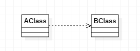

## 类之间的六种关系

### 1、继承（泛化）（Generalization）
继承关系，表示了子类和父类之间的关系

箭头：子类指向父类，实线空心三角形箭头

代码体现：子类、父类

---

### 2、实现（Interface Realization）

实现关系，表示接口和实现类之间的关系

箭头：虚线空心三角形箭头

代码体现：接口及实现接口的类

实现.png

---

### 3、依赖（Dependency）

是一种使用关系

箭头 ： 虚线箭头

代码体现 ： 局部变量、方法的参数或者对静态方法的调用

避免：双向依赖

---

### 4、关联（Association）

是一种拥有的关系,它使一个类知道另一个类的属性和方法

箭头：实线箭头

代码体现 ： 成员变量

注意：单向关联和双向关联

---

### 5、聚合 （Aggregation）

整体与部分的关系，部分可以脱离整体存在，聚合关系是关联关系的一种，是强的关联关系；关联和聚合在语法上无法区分，必须考察具体的逻辑关系。

箭头

代码体现：成员变量

---

### 6、组合（Composition）

整体与部分的关系，部分不能脱离整体存在

箭头

代码体现：成员变量

